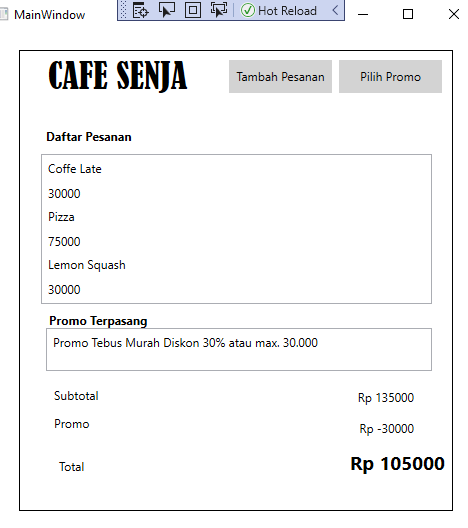

## 19.11.2733
 ## Trias Handayani
 ## OrderFood
Aplikasi ini difungsikan untuk melayani pemesanan menu dan menghitung total harga yang dipesan oleh pembeli 

# Fungsi
- User dapat melihat daftar makanan yang ditawarkan
- User dapat memasukkan atau menghapus makanan pilihan ke dalam keranjang
- User dapat melihat subtotal makanan yang terdapat pada keranjang
- User dapat melihat daftar voucher yang ditawarkan
- User dapat menggunakan salah satu voucher
- User dapat melihat harga total termasuk potongannya
# Simulasi
- Simulasi 1

- Simulasi 2

- Simulasi 3

# Penjelasan 
- Didalam folder Controller terdapat 3 kelas yaitu :

== ``MainWindowController.cs`` yang berfungsi untuk  penambahan item dan promo,menghapus item dan promo, serta memperoleh list data dari item yang dibeli dan promo yang digunakan.

-- ``PenawaranController.cs`` berfungsi untuk penambahan item yang dipih kedalam list,mengembalikan nilai pada list,serta menyimpan data yang telah ditambahkan.

-- ``PromoController.cs``berfungsi untuk penambahan promo yang dipilih kedalam lis,mengembalikan nilai pada list,dan untuk menyimpan data yang telah ditambahkan.
- Didalam folder model terdapat 4 kelas yaitu
-- ``Item.cs`` berfungsi untuk menampung item
--``KeranjangBuah.cs`` digunakan untuk menmpung item serta promo yang dipilih dan logiga perhitungan subtotal serta promo
``private void calculateSubTotal()
        {
            double subtotal = 0;
            double potongan = 0;
            foreach (Item item in itemBelanja)
            {
                subtotal += item.price;
            }

            foreach (Promo promo in itemPromo)
            {
                if (promo.discInPercent != 0)
                {

                    if (promo.discInPercent == 30)
                    {
                        if (subtotal >= 100000)
                        {
                            potongan -= 30000;
                        }
                        else
                        {
                            potongan -= subtotal * (promo.discInPercent / 100);
                        }
                    }
                    else
                    {
                        potongan -= subtotal * (promo.discInPercent / 100);
                    }
                }

                if (promo.disc != 0)
                {
                    potongan -= promo.disc;
                }
            }
            payment.updateTotal(subtotal, potongan);

        }``
 -- ``Payment.cs`` digunakan untuk menampung total dari pembayaran item 
 -- ``Promo.cs`` digunakan untuk menampung promo
 - Untuk mengatur logika dari tampilannya  terdapat:
 -- `MainWindow.xaml.cs``ada inisialisasi dan pembuatan beberapa instance serta kode untuk memasukkan data list promo dan item  kedalam listbox
 ``  public MainWindow()
        {
            InitializeComponent();

            payment = new Payment(this);

            KeranjangBelanja keranjangBelanja = new KeranjangBelanja(payment, this);

            controller = new MainWindowController(keranjangBelanja);

            listBoxPesanan.ItemsSource = controller.getSelectedItems();
            listBoxPakaiPromo.ItemsSource = controller.getSelectedPromos();

            initializeView();

        }``
-- ``Penawaran.xaml.cs`` terdapat pembuatan object item yang akan ditambahkan kedalam listbox
``        private void generateContentPenawaran()
        {
            Item drink1 = new Item("Coffe Late", 30000);
            Item drink2 = new Item("BlackTea", 20000);
            Item food1 = new Item("Pizza", 75000);
            Item drink3 = new Item("Milk Shake", 15000);
            Item food2 = new Item("Fried Rice Special", 45000);
            Item drink4 = new Item("Watermelon Juice", 25000);
            Item drink5 = new Item("Lemon Squash", 30000);
            
            

            Penawarancontroller.addItem(drink1);
            Penawarancontroller.addItem(drink2);
            Penawarancontroller.addItem(food1);
            Penawarancontroller.addItem(drink3);
            Penawarancontroller.addItem(food2);
            Penawarancontroller.addItem(drink4);
            Penawarancontroller.addItem(drink5);

            listPenawaran.Items.Refresh();
        }
``
-- ``PilihPromo.xaml.cs``terdapat pembuatan object promo yang akan ditambahkan kedalam list
``private void generateListPromo()
        {
            Model.Promo awalTahun = new Model.Promo(title: "Promo Awal Tahun Diskon 25%", discInPercent: 25);
            Model.Promo tebusMurah = new Model.Promo(title: "Promo Tebus Murah Diskon 30% atau max. 30.000", discInPercent: 30);
            Model.Promo promoNatal = new Model.Promo(title: "Promo Natal Potongan 10000", disc: 10000);

            promoController.addItem(awalTahun);
            promoController.addItem(tebusMurah);
            promoController.addItem(promoNatal);

            DaftarPromo.Items.Refresh();
        }``
        
